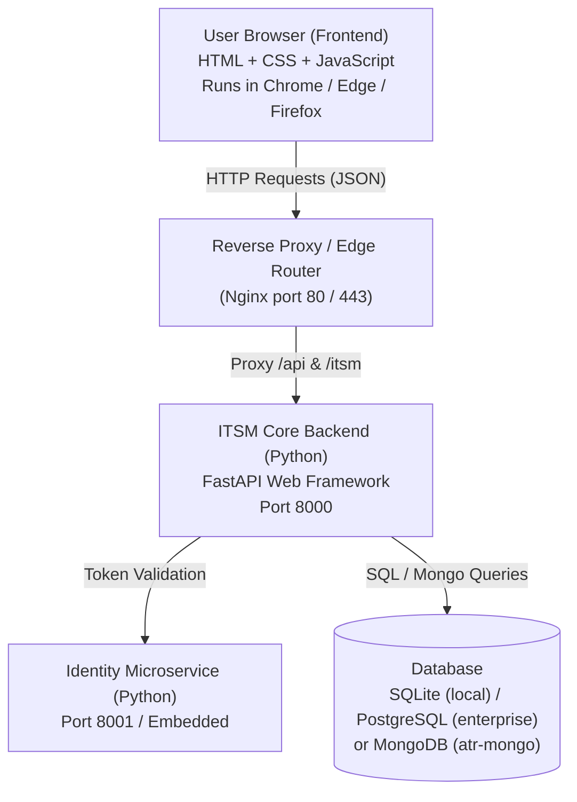
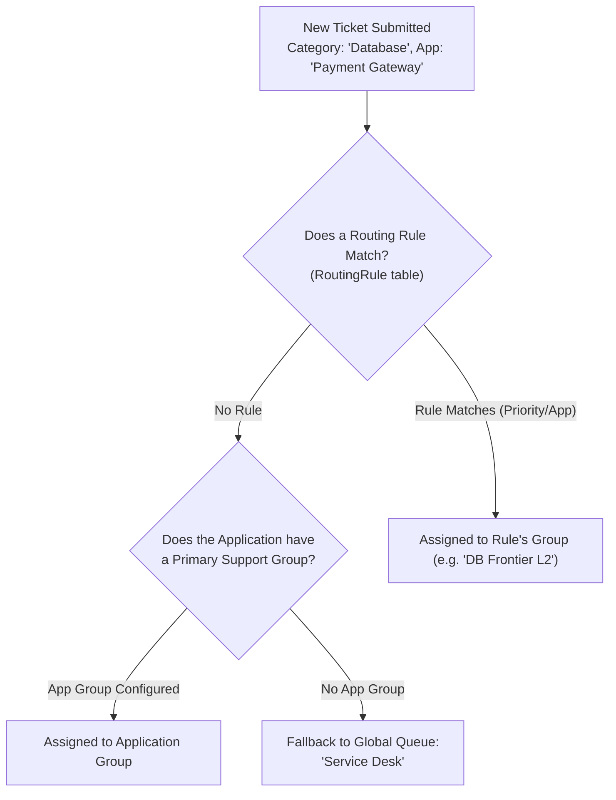

# GenWizard Support Portal (Nexus ITSM) — Architecture & Developer Handbook

Welcome! This handbook is written specifically for you to understand, maintain, debug, and extend this codebase end-to-end, even if you are coming in without prior Python or JavaScript experience.

---

## 1. What is this Project?

This project is **GenWizard Support Portal** (internally codenamed **Nexus ITSM**). It is a full-featured, enterprise-grade **IT Service Management (ITSM)** platform designed as a modern, lightweight, AI-enabled replacement for tools like ServiceNow or Jira Service Management.

### Core Capabilities
1. **Ticket Operations**: Incidents (outages/bugs), Service Requests (hardware/software access requests), and Change Requests (system upgrades and deployments).
2. **SLA (Service Level Agreement) Engine**: Automatically counts down response and resolution target times, escalating when deadlines are breached.
3. **AI & Automation Engine**: Automatic categorization of tickets, similarity detection, automated closure of resolved tickets, and automated work-note generation.
4. **On-Call & Routing Schedules**: Routes tickets to the right team (Assignment Groups) based on application, project, priority, and on-call calendars.
5. **Enterprise Authentication (SSO & RBAC)**: Integrates with external Identity Management (Keycloak, SAML, ATR Gateway, Active Directory) with strict role-based access control (Admin, Support Member, End User).

---

## 2. High-Level Architecture (The Big Picture)

The system is organized into a clean **Client-Server Architecture**:



* **Frontend (`/frontend`)**: What the user sees on their screen. Pure HTML (structure), CSS (styling), and JavaScript (behavior). No complex compilation or build step required.
* **Backend (`/backend`)**: The Python server. Exposes REST APIs (e.g., `/api/incidents`, `/api/auth/current`). It verifies permissions, computes business logic, and talks to the database.
* **Identity Service (`/identity_service`)**: Microservice for user accounts, role definitions, and Single Sign-On (SSO) token validation.

---

## 3. Python & JavaScript Fundamentals (Learned Through This Code)

To maintain this project, you only need to understand a few core patterns.

### A. Python (The Backend Language)

Python reads like structured English. Here are the 5 patterns you will see constantly:

#### 1. Functions and Decorators
```python
# A function is a reusable block of code:
def calculate_sla(priority):
    if priority == "Critical":
        return 60  # minutes
    return 240

# In FastAPI, a "Decorator" starts with '@'. It attaches a URL route to a function:
@router.get("/api/incidents")
def list_incidents(db: Session = Depends(get_db)):
    # Whenever a browser does a GET request to /api/incidents, this code runs!
    tickets = db.query(Incident).all()
    return [t.to_dict() for t in tickets]
```

#### 2. Variables and Dictionaries (Key-Value pairs)
```python
# A Dictionary (dict) stores key-value pairs (like a JSON object):
user = {
    "username": "john.smith",
    "email": "john.smith@accenture.com",
    "is_admin": False
}
# Accessing values:
print(user["username"])  # prints "john.smith"
```

#### 3. Database Models (SQLAlchemy ORM)
Instead of writing raw SQL (`SELECT * FROM users`), Python uses "Models" which represent database tables as Python Classes:
```python
# In backend/models.py:
class Incident(Base):
    __tablename__ = "incidents"
    id = Column(Integer, primary_key=True)
    ticket_number = Column(String(32), unique=True)
    status = Column(String(32), default="New")
    short_description = Column(String(255))
```
To query or save in database:
```python
# Query:
inc = db.query(Incident).filter(Incident.id == 5).first()

# Save:
new_inc = Incident(ticket_number="INC1001", short_description="Printer offline")
db.add(new_inc)
db.commit()   # writes to the database disk
```

#### 4. Dependency Injection (`Depends`)
FastAPI uses `Depends()` to automatically inject utilities into route handlers:
```python
@router.post("/api/tickets")
def create_ticket(
    payload: TicketSchema,               # incoming JSON body
    current_user: User = Depends(get_current_user),  # who is calling this?
    db: Session = Depends(get_db)        # open database connection
):
    # current_user is guaranteed to be validated before this code runs!
```

---

### B. JavaScript (The Frontend Language)

JavaScript runs entirely inside the user's browser. It has 4 primary jobs in this project:

#### 1. Finding Elements on the Screen (DOM Manipulation)
HTML has tags with unique `id` attributes (e.g. `<div id="userName">...</div>`).
JavaScript finds and modifies them:
```javascript
// Find the element with id="userName":
const nameEl = document.getElementById('userName');

// Change the text visible to the user:
nameEl.textContent = 'Satya Swaroop';
```

#### 2. Listening to User Clicks (Event Listeners)
```javascript
const myButton = document.getElementById('createTicketBtn');
myButton.addEventListener('click', function() {
    alert('Button was clicked!');
});
```

#### 3. Calling the Backend (`fetch` and `async / await`)
The browser sends network requests to Python via `fetch`:
```javascript
async function loadTickets() {
    // 1. Send network request to backend:
    const response = await fetch('/api/incidents');
    
    // 2. Parse the JSON response:
    const data = await response.json();
    
    // 3. Now we have an array of tickets!
    console.log('Tickets from server:', data);
}
```

#### 4. Remembering Things in the Browser (`localStorage`)
`localStorage` is a small key-value database built into every web browser that survives page reloads:
```javascript
// Save user's token or session:
localStorage.setItem('sso_username', 'john.doe');

// Retrieve it later:
const user = localStorage.getItem('sso_username'); // returns 'john.doe'

// Remove it when logging out:
localStorage.removeItem('sso_username');
```

---

## 4. Codebase Tour: Where Everything Lives

Here is your roadmap of the project's folder structure:

```
service_now_ai/
│
├── backend/                       # Python FastAPI Backend
│   ├── main.py                    # Server entrypoint, middleware, CSP, app initialization
│   ├── database.py                # Database connection setup (SQLite / Postgres / Mongo)
│   ├── models.py                  # Database table definitions (Users, Tickets, Groups)
│   ├── security.py                # SSO, Keycloak, JWT tokens, user authentication logic
│   ├── seed_data.py               # Initial setup (clean blank state in production)
│   ├── mongo_dal.py               # MongoDB Data Access Layer
│   └── routes/                    # API Route Handlers
│       ├── incidents.py           # Incident ticket endpoints (/api/incidents)
│       ├── service_requests.py    # Service request endpoints (/api/service-requests)
│       ├── changes.py             # Change management endpoints (/api/changes)
│       ├── auth.py                # Authentication endpoints (/api/auth/current, login, logout)
│       ├── admin_groups.py        # Support teams & assignment groups (/api/admin/groups)
│       └── sla.py                 # SLA policy administration
│
├── frontend/                      # User Interface (HTML, CSS, JS)
│   ├── index.html                 # The Single Page Application (SPA) HTML shell
│   ├── sso-redirect.html          # Intermediate screen during enterprise SSO handshakes
│   ├── js/
│   │   ├── init.js                # Runs first: loads early SSO identity, dynamic base URL
│   │   ├── app.js                 # The brain of the UI (renders tickets, dashboards, modals)
│   │   └── sso-redirect.js        # Helper script for SAML/SSO authentication flow
│   ├── css/
│   │   ├── style.css              # Custom styling, dark/light theme variables
│   │   └── tailwind.min.css       # Locally bundled Tailwind CSS framework
│   └── vendor/                    # Local JS libraries (Chart.js, Lucide icons, Swagger UI)
│
├── identity_service/              # Independent Identity Management Microservice
│   ├── main.py                    # Identity API (users, groups, tokens)
│   └── models.py                  # Identity database schema
│
├── tests/                         # Automated Pytest Suite (95 tests)
│   ├── test_existing_app_integration.py  # Tests external IM & SSO authentication
│   ├── test_automation_api.py            # Tests API schemas and CSP headers
│   └── test_clean_production_state.py    # Tests zero-seed database state
│
├── scripts/                       # Maintenance & startup utilities
│   └── run_services.py            # Starts backend and identity services together
│
├── package-addon.sh               # Builds production distribution archives (.tar.gz / .atr.gz)
└── install-existing-app.sh        # Installer script for production servers
```

---

## 5. End-to-End Walkthrough: What Happens Behind the Scenes?

### Scenario A: An Employee Signs In via SSO
1. **The URL**: The user accesses `http://portal.company.com/itsm/?username=john.doe@accenture.com`.
2. **`frontend/js/init.js` (Browser)**:
   - Reads the URL search parameter `?username=...`.
   - Extracts the username (`john.doe@accenture.com`).
   - Cleans the display name into `"John Doe"`.
   - Populates `#userName` in the top header immediately so the user doesn't see "Loading..." or a flash of "admin".
   - Stores `sso_username` in browser `localStorage`.
3. **`frontend/js/app.js` (Browser)**:
   - Calls `GET /api/auth/current`.
   - Attaches headers: `X-User-Name: john.doe@accenture.com`.
4. **`backend/security.py` (Server)**:
   - `get_current_user()` detects `X-User-Name`.
   - Finds or auto-provisions `john.doe@accenture.com` in the database.
   - Formats the email as `john.doe@accenture.com` (never duplicating `@enterprise.corp`).
   - Returns the User JSON object with roles and permissions.
5. **`frontend/js/app.js` (Browser)**:
   - Receives the User JSON.
   - Adjusts the left sidebar: if the user is an End User, hides Admin settings; if Admin, shows full controls.

### Scenario B: Creating a Ticket
1. **User Action**: The employee clicks "Create Ticket", selects Category "Software", types "VPN disconnecting", and clicks Submit.
2. **`frontend/js/app.js`**:
   - Gathers inputs into a JavaScript object:
     `{ category: "Software", short_description: "VPN disconnecting", priority: "Medium" }`
   - Sends `POST /api/incidents` with `body: JSON.stringify(...)`.
3. **`backend/routes/incidents.py`**:
   - `create_incident()` function receives the request.
   - Computes automatic ticket number: `INC0001042`.
   - Checks routing rules: Category "Software" -> Assigns to "Payment Application Support" group.
   - Computes SLA deadlines: Resolution due in 8 business hours.
   - Writes the new record to the database table `incidents`.
   - Emits a WebSocket/Notification event to alert support engineers.
   - Returns HTTP 200 with the created incident JSON.
4. **`frontend/js/app.js`**:
   - Shows a green toast notification: *"Ticket INC0001042 created successfully!"*
   - Refreshes the ticket grid.

---

## 6. How to Debug Like a Pro

When something doesn't work as expected, follow this 2-step methodology:

### Step 1: Is it Frontend or Backend?
Open **Google Chrome Developer Tools** (press `F12` or Right Click -> *Inspect*):
* **Console Tab**: Red errors here indicate a JavaScript issue (e.g. `TypeError: Cannot read properties of undefined`).
* **Network Tab**: Click on requests (like `/api/auth/current` or `/api/incidents`):
  * Status **200 OK**: Backend succeeded. The issue is in how JavaScript rendered the data.
  * Status **401 Unauthorized**: User token expired or invalid credentials.
  * Status **403 Forbidden**: User lacks permission (e.g. non-admin trying to edit SLA).
  * Status **404 Not Found**: URL path does not exist.
  * Status **500 Internal Server Error**: Python crashed! Look at the Backend logs.

### Step 2: Reading Python Backend Logs
When Python crashes (Status 500), it prints a **Traceback** in the terminal:
```text
Traceback (most recent call last):
  File "backend/routes/incidents.py", line 145, in create_incident
    priority_num = int(payload.priority)
ValueError: invalid literal for int() with base 10: 'High'
```
**How to read it**:
1. Look at the **very last line**: It tells you the exact problem (`ValueError: 'High' cannot be turned into an integer`).
2. Look at the line above it: It tells you the **exact file and line number** (`backend/routes/incidents.py:145`).

---

## 7. How to Add a New Feature: Step-by-Step Recipe

Let's say you want to add a new field called **"Asset Tag"** to Incidents:

1. **Step 1: Update Database Model (`backend/models.py`)**:
   Add the column to `class Incident`:
   ```python
   asset_tag = Column(String(64), nullable=True)
   ```
2. **Step 2: Update the API Route (`backend/routes/incidents.py`)**:
   In `create_incident`, save the incoming field:
   ```python
   new_inc.asset_tag = payload.get("asset_tag")
   ```
3. **Step 3: Update HTML (`frontend/index.html`)**:
   In the Create Ticket modal, add an input field:
   ```html
   <label>Asset Tag</label>
   <input type="text" id="incAssetTag" placeholder="e.g. LAPTOP-9482">
   ```
4. **Step 4: Update Frontend JS (`frontend/js/app.js`)**:
   Include `asset_tag` when submitting the ticket:
   ```javascript
   const payload = {
       ...
       asset_tag: document.getElementById('incAssetTag').value
   };
   ```
5. **Step 5: Verify with Tests**:
   Run the test suite:
   ```bash
   .venv/bin/pytest tests/
   ```

---

## 8. Everyday Developer Cheatsheet

| Task | Command |
|---|---|
| **Run All Tests** | `.venv/bin/pytest tests/` |
| **Run Specific Test** | `.venv/bin/pytest tests/test_existing_app_integration.py` |
| **Start Development Server** | `.venv/bin/python scripts/run_services.py` |
| **Check Port 8000** | `curl http://localhost:8000/health` |
| **Rebuild Deployment Packages** | `./package-addon.sh` |
| **Check Git Status** | `git status` |
| **Commit Changes** | `git add -A && git commit -m "feat: description"` |

---

## 9. Full Blueprint: Adding a Brand-New Module (e.g., "Problem Management")

Suppose you want to add a brand-new entity called **Problems** (root-cause analysis for multiple recurring incidents) with its own sidebar menu, database table, and API endpoints.

Here is the exact end-to-end recipe:

### Step 1: Define the Database Model (`backend/models.py`)
Add a new SQLAlchemy model in [`backend/models.py`](file:///Users/ritika/Downloads/application_repo/service_now_ai/backend/models.py):

```python
class Problem(Base):
    __tablename__ = "problems"

    id = Column(Integer, primary_key=True, index=True)
    problem_number = Column(String(32), unique=True, index=True)  # e.g. PRB0001001
    short_description = Column(String(255), nullable=False)
    root_cause = Column(Text, nullable=True)
    workaround = Column(Text, nullable=True)
    status = Column(String(32), default="Investigation")  # Investigation, Known Error, Resolved, Closed
    priority = Column(String(32), default="Medium")
    assigned_group_id = Column(Integer, ForeignKey("assignment_groups.id"), nullable=True)
    created_at = Column(DateTime, default=datetime.utcnow)
    updated_at = Column(DateTime, default=datetime.utcnow, onupdate=datetime.utcnow)

    def to_dict(self):
        return {
            "id": self.id,
            "problem_number": self.problem_number,
            "short_description": self.short_description,
            "root_cause": self.root_cause,
            "workaround": self.workaround,
            "status": self.status,
            "priority": self.priority,
            "assigned_group_id": self.assigned_group_id,
            "created_at": self.created_at.isoformat() if self.created_at else None,
            "updated_at": self.updated_at.isoformat() if self.updated_at else None,
        }
```

---

### Step 2: Create the API Route File (`backend/routes/problems.py`)
Create a new route file in `backend/routes/problems.py`:

```python
from fastapi import APIRouter, Depends, HTTPException, Query
from sqlalchemy.orm import Session
from pydantic import BaseModel
from typing import Optional, List

from backend.database import get_db
from backend.models import Problem, User
from backend.security import get_current_user

router = APIRouter(prefix="/api/problems", tags=["Problems"])

# Request payload validator (Pydantic schema)
class ProblemCreateSchema(BaseModel):
    short_description: str
    root_cause: Optional[str] = None
    workaround: Optional[str] = None
    priority: Optional[str] = "Medium"
    assigned_group_id: Optional[int] = None

@router.get("")
def list_problems(
    status: Optional[str] = Query(None),
    db: Session = Depends(get_db),
    current_user: User = Depends(get_current_user)
):
    query = db.query(Problem)
    if status:
        query = query.filter(Problem.status == status)
    records = query.order_by(Problem.id.desc()).all()
    return [p.to_dict() for p in records]

@router.post("")
def create_problem(
    payload: ProblemCreateSchema,
    db: Session = Depends(get_db),
    current_user: User = Depends(get_current_user)
):
    count = db.query(Problem).count() + 1
    p_num = f"PRB{count:07d}"

    prob = Problem(
        problem_number=p_num,
        short_description=payload.short_description,
        root_cause=payload.root_cause,
        workaround=payload.workaround,
        priority=payload.priority or "Medium",
        assigned_group_id=payload.assigned_group_id,
        status="Investigation"
    )
    db.add(prob)
    db.commit()
    db.refresh(prob)
    return prob.to_dict()
```

---

### Step 3: Register the Router (`backend/main.py`)
In [`backend/main.py`](file:///Users/ritika/Downloads/application_repo/service_now_ai/backend/main.py):
1. Import your new router:
   ```python
   from backend.routes import problems
   ```
2. Mount it to the FastAPI application:
   ```python
   app.include_router(problems.router)
   ```

---

### Step 4: Add the Tab to the Sidebar (`frontend/index.html`)
In [`frontend/index.html`](file:///Users/ritika/Downloads/application_repo/service_now_ai/frontend/index.html), add a navigation button inside `<aside>`:

```html
<button data-view="problems" class="nav-item flex items-center space-x-3 px-3 py-2 rounded-xl text-xs font-medium text-slate-300 hover:bg-purple-900/30 transition-all">
  <i data-lucide="alert-octagon" class="w-4 h-4 text-purple-400"></i>
  <span>Problems</span>
</button>
```

And inside `<main id="mainContent">`, add the empty view container:
```html
<section id="viewProblems" class="view-panel hidden p-6 space-y-6">
  <div class="flex justify-between items-center">
    <h2 class="text-xl font-bold">Problem Management</h2>
    <button id="openCreateProblemBtn" class="bg-purple-600 hover:bg-purple-700 text-white px-4 py-2 rounded-xl text-xs font-semibold">
      + New Problem
    </button>
  </div>
  <div id="problemsTableContainer"></div>
</section>
```

---

### Step 5: Render and Fetch in JavaScript (`frontend/js/app.js`)
In [`frontend/js/app.js`](file:///Users/ritika/Downloads/application_repo/service_now_ai/frontend/js/app.js):

1. **Add to your view switcher**:
   ```javascript
   if (viewName === 'problems') {
       loadProblemsView();
   }
   ```
2. **Fetch and render the table**:
   ```javascript
   async function loadProblemsView() {
       const res = await fetch('/api/problems');
       const problems = await res.json();
       
       const container = document.getElementById('problemsTableContainer');
       if (!problems.length) {
           container.innerHTML = '<p class="text-xs text-slate-400">No active problems.</p>';
           return;
       }
       
       const rows = problems.map(p => `
           <tr class="border-b border-[var(--border-color)] hover:bg-[var(--bg-tertiary)]">
               <td class="p-3 font-mono text-purple-400 font-bold">${p.problem_number}</td>
               <td class="p-3 font-medium">${p.short_description}</td>
               <td class="p-3"><span class="px-2 py-0.5 rounded text-[11px] bg-amber-500/20 text-amber-300">${p.status}</span></td>
               <td class="p-3">${p.priority}</td>
               <td class="p-3 font-mono text-xs text-slate-400">${p.workaround || 'None'}</td>
           </tr>
       `).join('');
       
       container.innerHTML = `
           <table class="w-full text-xs text-left">
               <thead class="bg-[var(--bg-tertiary)] text-slate-400 uppercase">
                   <tr>
                       <th class="p-3">Problem #</th>
                       <th class="p-3">Summary</th>
                       <th class="p-3">Status</th>
                       <th class="p-3">Priority</th>
                       <th class="p-3">Workaround</th>
                   </tr>
               </thead>
               <tbody>${rows}</tbody>
           </table>
       `;
   }
   ```

---

## 10. Adding Automated Webhooks (e.g. Teams / Slack / Discord Alerts)

When a **P1 / Critical Incident** is reported, you often want to send an instant alert to a Microsoft Teams or Slack channel.

### Where to add it: `backend/routes/incidents.py`

In `create_incident` (inside [`backend/routes/incidents.py`](file:///Users/ritika/Downloads/application_repo/service_now_ai/backend/routes/incidents.py)), add a helper that triggers in the background:

```python
import httpx

def send_teams_critical_alert(incident_number: str, title: str, caller_name: str):
    webhook_url = os.getenv("TEAMS_CRITICAL_WEBHOOK_URL")
    if not webhook_url:
        return  # Webhook not configured; gracefully skip
    
    card_payload = {
        "@type": "MessageCard",
        "@context": "http://schema.org/extensions",
        "themeColor": "D9383A",  # Red alert
        "summary": f"CRITICAL INCIDENT: {incident_number}",
        "sections": [{
            "activityTitle": f"🚨 P1 Incident Created: {incident_number}",
            "activitySubtitle": f"Reported by {caller_name}",
            "facts": [
                {"name": "Summary", "value": title},
                {"name": "Priority", "value": "Critical (P1)"},
                {"name": "Status", "value": "Active / Unassigned"}
            ],
            "markdown": True
        }]
    }
    try:
        httpx.post(webhook_url, json=card_payload, timeout=3.0)
    except Exception as e:
        logger.warning(f"Failed to deliver Teams webhook: {e}")
```

Call it immediately whenever priority is `"Critical"`:
```python
if inc.priority == "Critical":
    send_teams_critical_alert(inc.ticket_number, inc.short_description, current_user.full_name)
```

---

## 11. Custom Role-Based Access Control (RBAC)

Want to restrict an action (e.g., deleting an application or modifying an SLA) to specific roles or groups?

FastAPI provides dependency functions in [`backend/security.py`](file:///Users/ritika/Downloads/application_repo/service_now_ai/backend/security.py):

### 1. The Built-in Guards:
- `require_admin`: Strictly requires Platform Administrator (`itsm_admin` role, or membership in `itsm_admin` group).
- `require_support`: Allows either Admins or Support Engineers (`itsm_user` role).

### 2. How to Protect a Route:
```python
from backend.security import require_admin

@router.delete("/api/applications/{app_id}")
def delete_application(
    app_id: int,
    current_user: User = Depends(require_admin),  # <--- ONLY Admins can reach this!
    db: Session = Depends(get_db)
):
    app_obj = db.query(Application).filter(Application.id == app_id).first()
    db.delete(app_obj)
    db.commit()
    return {"message": "Application deleted"}
```
If an ordinary employee calls this endpoint, FastAPI automatically responds with:
```json
{
  "status_code": 403,
  "detail": "Action requires administrative privileges"
}
```

---

## 12. How Routing Rules & Automatic Queue Assignment Work

When a ticket arrives, how does the system know which group gets it?

Look at [`backend/routes/incidents.py`](file:///Users/ritika/Downloads/application_repo/service_now_ai/backend/routes/incidents.py):



You can add custom routing rules directly through the UI in **Admin Settings -> Routing Rules** or via database entries in `routing_rules`.

---

## 13. Adding Automated Tests for New Features

Whenever you add code, add a test to the `tests/` directory to prove it works and prevent future regressions.

### Writing a Simple Pytest Test:
In `tests/test_my_new_feature.py`:
```python
import pytest
from fastapi.testclient import TestClient
from backend.main import app

@pytest.fixture
def client():
    return TestClient(app)

def test_create_and_fetch_problem(client):
    # 1. Create problem
    payload = {
        "short_description": "Intermittent DNS resolution failures",
        "priority": "High",
        "workaround": "Use secondary DNS 10.0.0.2"
    }
    res = client.post("/api/problems", json=payload, headers={"X-User-ID": "1"})
    assert res.status_code == 200
    created = res.json()
    assert created["problem_number"].startswith("PRB")
    assert created["status"] == "Investigation"

    # 2. Fetch list
    list_res = client.get("/api/problems", headers={"X-User-ID": "1"})
    assert list_res.status_code == 200
    problems = list_res.json()
    assert len(problems) > 0
    assert any(p["problem_number"] == created["problem_number"] for p in problems)
```

Run your new test:
```bash
.venv/bin/pytest tests/test_my_new_feature.py
```
If it prints green dots, your feature is verified!

